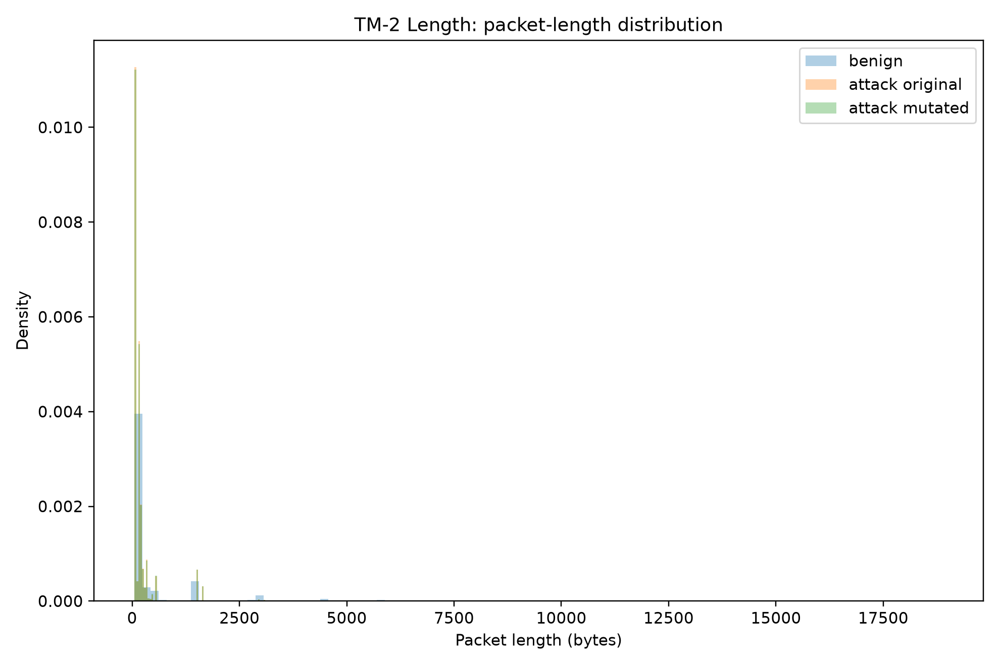
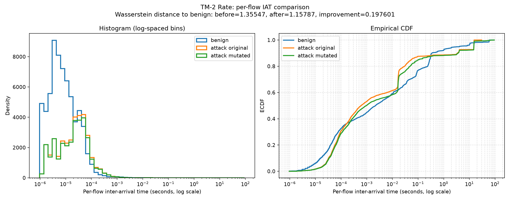

# Reference demonstration outputs

These files were generated from the included DoHBrw demo captures on Ubuntu
24.04 with Python 3.12 and seed 42. They provide an immediately inspectable
reference for the five Bash demonstrations; rerunning the scripts writes fresh
outputs under `vis/`.

The length experiment preserved all 9,060 packets and every timestamp while
changing 78 packet lengths by a total of 62,130 bytes. The rate experiment
preserved packet content and lengths while changing the timestamps of 707
selected packets. Its per-flow IAT Wasserstein distance to the benign reference
changed from 1.35547 to 1.15787.

